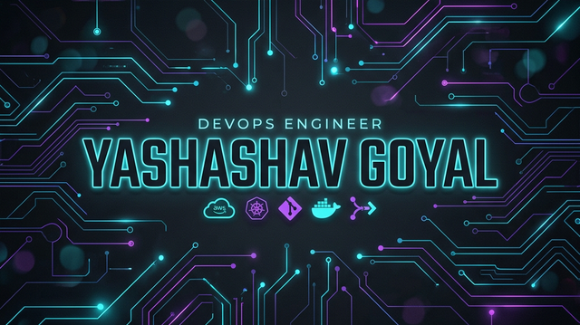
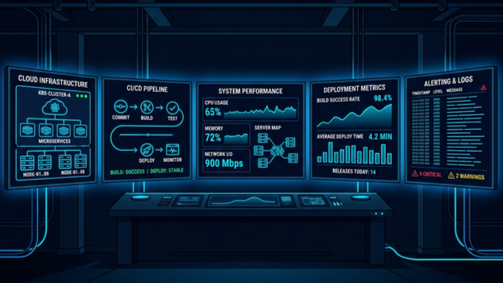

<div align="center">
  
</div>

<div align="center">
  
</div>

<div align="center">
  
  
</div>

---

### ⚡ $ whoami

```bash
> name: Yashashav Goyal
> role: DevOps Engineer | Backend Developer
> focus: Distributed Systems | Cloud Infrastructure | Scalable Systems
> location: India
```

---

### 👨‍💻 About Me

<div align="center">
  <table border="0">
    <tr>
      <td width="55%" align="left" valign="top">
        <br/>
        <ul>
          <li>🎓 <b>Computer Science Student</b></li>
          <li>🚀 <b>DevOps Lead</b> @ GDG GITS</li>
          <li>🏆 <b>Smart India Hackathon 2023 Winner</b></li>
          <li>🥈 <b>HackItSapiens 2.0 Runner-Up</b> (National)</li>
          <li>⚡ Building scalable backend systems and cloud infrastructure</li>
          <li>🔬 Passionate about <b>Distributed Systems, DevOps & Reliability</b></li>
        </ul>
      </td>
      <td width="45%" align="center">
        
      </td>
    </tr>
  </table>
</div>

---

### 🛠 Tech Stack

<div align="center">
  <table border="0">
    <tr>
      <td align="center"><b>Languages</b></td>
      <td align="center"><b>Frontend</b></td>
      <td align="center"><b>Backend</b></td>
    </tr>
    <tr>
      <td align="center"></td>
      <!-- rust -->
      <td align="center"></td>
      <td align="center"></td>
    </tr>
    <tr>
      <td align="center"><b>Databases</b></td>
      <td align="center"><b>DevOps & Tools</b></td>
      <td align="center"><b>Cloud & Systems</b></td>
    </tr>
    <tr>
      <td align="center"></td>
      <td align="center"></td>
      <td align="center"></td>
    </tr>
  </table>
</div>

---

### 🚀 Current Focus

<div align="center">
  <br/><br/>
  <table>
    <tr>
      <td align="center">
        <br/>
        <b>Cloud Infrastructure</b>
      </td>
      <td align="center">
        <br/>
        <b>Container Orchestration</b>
      </td>
      <td align="center">
        <br/>
        <b>Backend Systems</b>
      </td>
      <td align="center">
        <br/>
        <b>Distributed Systems</b>
      </td>
    </tr>
  </table>
</div>

---

### 🧪 Github Contributions

<div align="center">
  <table width="100%">
    <tr>
      <td width="100%" align="center">
        <a href="https://github.com/yashashavgoyal">
          
        </a>
      </td>
    </tr>
  </table>
</div>

---

### 📊 GitHub Activity

<div align="center">
  
</div>

---

### 🐍 Contribution Snake

<div align="center">
  <picture>
    <source media="(prefers-color-scheme: dark)" srcset="https://raw.githubusercontent.com/yashashavgoyal/yashashavgoyal/output/github-contribution-grid-snake-dark.svg">
    <source media="(prefers-color-scheme: light)" srcset="https://raw.githubusercontent.com/yashashavgoyal/yashashavgoyal/output/github-contribution-grid-snake.svg">
    
  </picture>
</div>

---

### ⚡ Terminal

```bash
$ whoami --status
DevOps engineer focused on building reliable infrastructure,
scalable backend systems, and efficient developer workflows.

$ curiosity --level max
Exploring distributed systems, cloud architecture,
and automation to build resilient platforms.
```

---

### 🌐 Connect With Me

<div align="center">
  <a href="https://linkedin.com/in/yashashavgoyal">
    
  </a>
  <a href="https://twitter.com/yashashavgoyal">
    
  </a>
  <a href="mailto:yashashavgoyal@gmail.com">
    
  </a>
</div>
